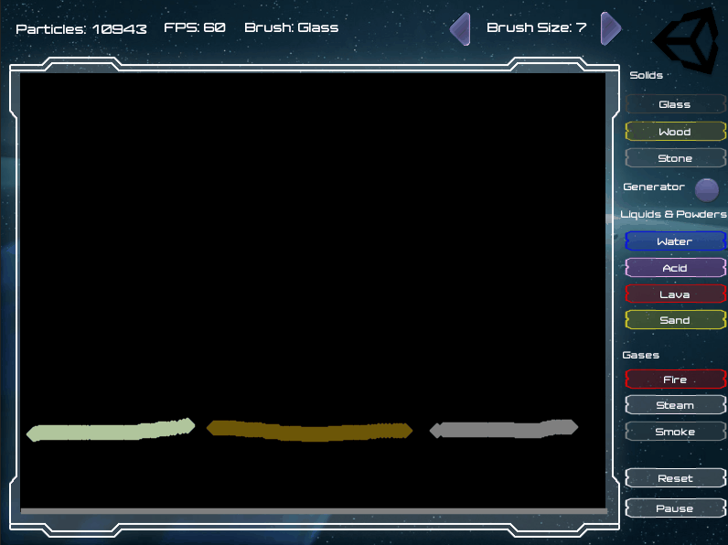

# UniPowder

This is a Unity version of a *[Falling Sand Game](https://en.wikipedia.org/wiki/Falling-sand_game)* or a *[Powder Toy Game](https://en.wikipedia.org/wiki/The_Powder_Toy)*.

Basically the game allows you to add one pixel particle (AKA powders) of different elements (sand, water, acid...) on screen and each of these element is simulated individually as it interacts with other elements.

This uses the newly release *[Entities Component Systems](https://github.com/Unity-Technologies/EntityComponentSystemSamples)* unity library to parallized entities simulation.

These are resources that have influenced and help the creation of this project:

- [ECS Annoncement](https://unity3d.com/unity/features/job-system-ECS)
- [The Official Powder Toy app](http://powdertoy.co.uk/)
- [Powder Toy sources](https://github.com/ThePowderToy/The-Powder-Toy)
- [Powder Toy in Javascript](https://github.com/SopaXorzTaker/js-powdertoy)
- [Powder Clone in C#](https://github.com/ruarai/PowderClone/tree/master/PowderClone)
- [Powder game in java](https://github.com/daveyognaught/powderinjava)

## Element interactions

- Water remove fire
- Fire burns wood and turns it into smoke or fire.
- Acid destroy everything except Glass
- Lava destroy evertyhing except Stone
- Steam condenses on Stone and turns into water
- Water turns into steam when touching lava
- Sand turns into glass when eated by fire.

## Generators
Most elements who are not solid (everythign except Stone, Wood and Glass) can have a *generator* that will poured new elements each frame.

